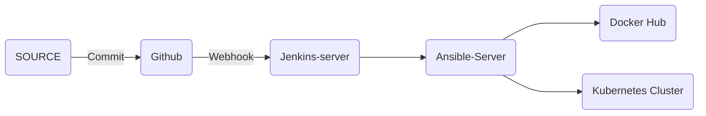

# Devops_project_1
==============================

## Authors

- [@dev-hack95](https://www.github.com/dev-hack95)

## Project Status
- Progress

## Table of Contents

  - [Problem Statement](#Problem-Statement)
  - [Flowchart](#Flowchart)
  - [Tech Stack](#tech-stack)
  - [Results](#Results)

## Flowchart

## Tech Stack
  1. Jenkins
  2. Ansible
  3. Docker
  4. Kubernetes(Minikube)
  5. aws
  6. Github Webhooks